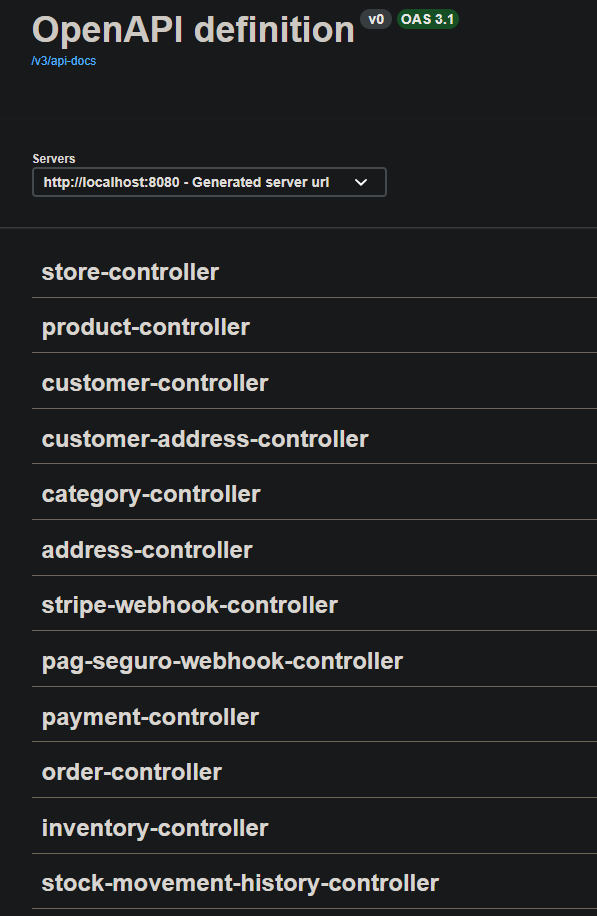
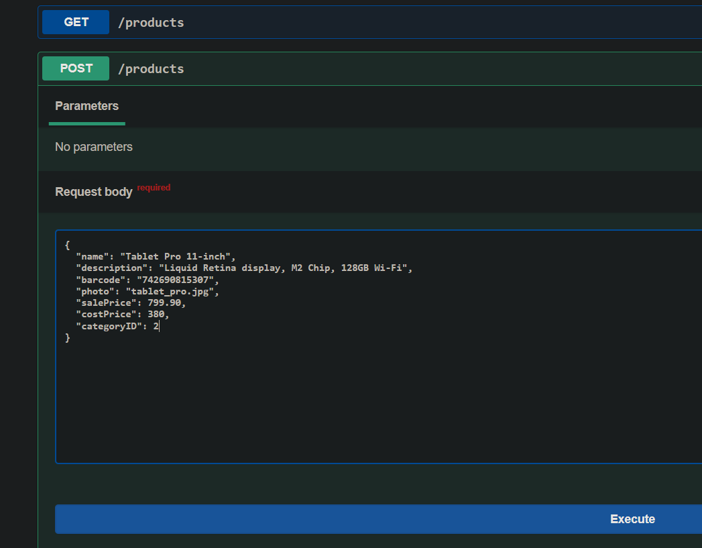
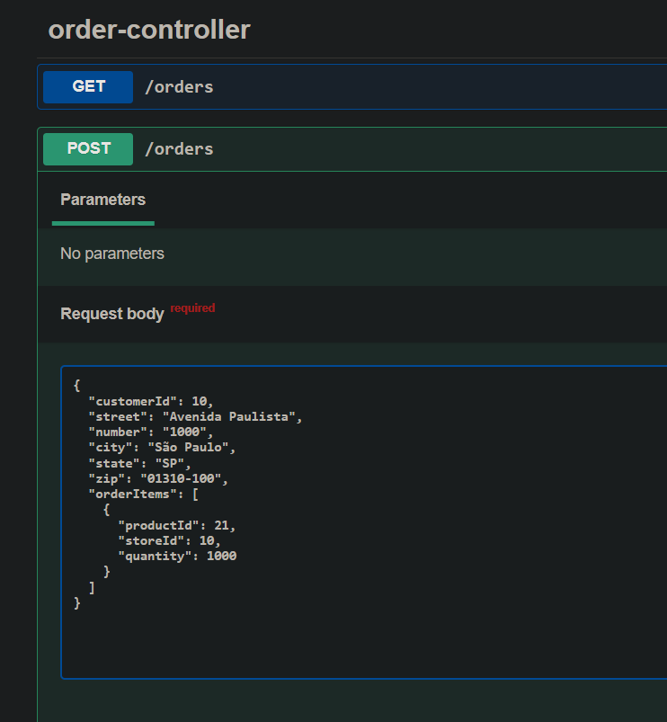
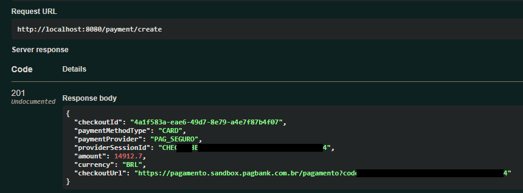
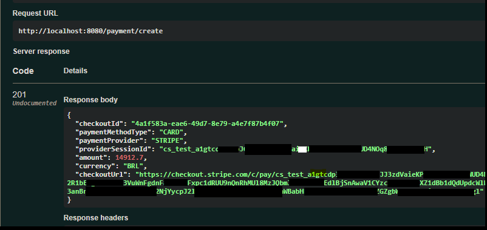
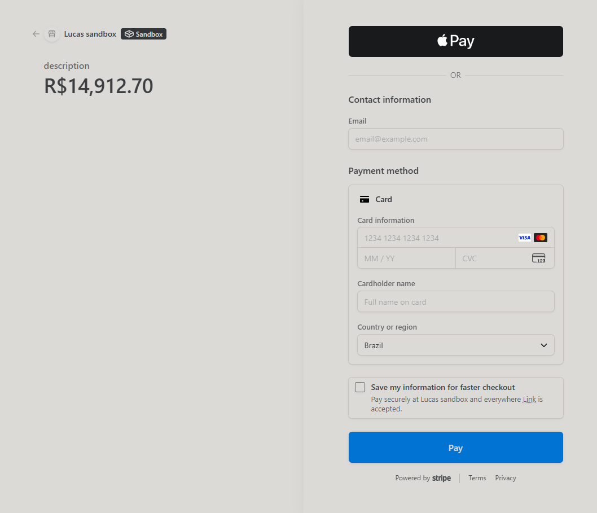
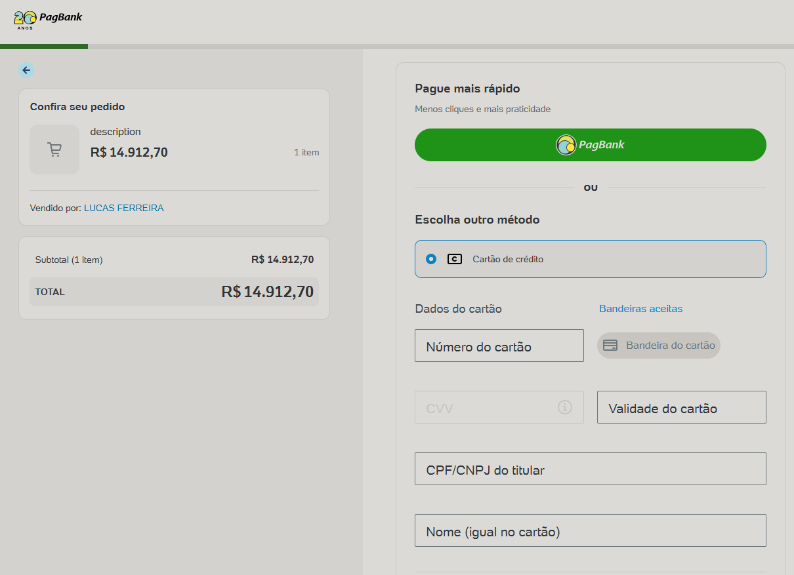
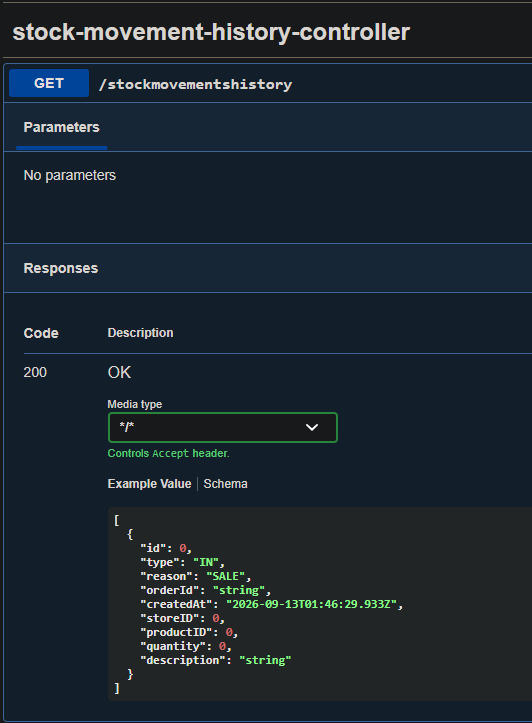

# Store_Management_System

## REST API developed for Stores, clients, products, orders and stock management🛒🛍️
## (Work in progress)

<br>

## 🌐Techlogies:

- Java 21
- Spring Boot
- Spring Data JPA
- PostgreSQL
- Maven

## 🛠️Functionalities

- Stores creation
- Clients creation
- Products creation
- Orders management
- Stock control
- Stock moviment history

## 📐Architecture

- Controller
- Service
- Repository
- DTOs
- Exception Handler
- Validation

<br>

## ▶️How to execute

### 🗃️Database


### 👇Here, you have to configure the variables in application-example.yml
```bash
url=jdbc:postgresql://localhost:8080/PUT_YOUR_DATABASE_HERE
username:PUT_YOUR_USERNAME_HERE
password:PUT_YOUR_PASSWORD_HERE
```
<br>

### 👇Here, you have to configure your Stripe keys
```bash
*Secret key* is a private server-side password used to securely connect your backend code to your Stripe API account.
*Webhook key* is a unique code that your server uses to verify that the webhook events that you receive is genuinely sent from Stripe.

stripe:
  secret-key: ${STRIPE_SECRET_KEY:PUT_YOUR_STRIPE_SECRET_KEY_HERE}
  webhook-key: ${STRIPE_WEBHOOK_KEY:PUT_YOUR_WEBHOOK_KEY_HERE}
```
> 

<br>

### 👇Here, you have to configure your PagSeguro keys
```bash
pagbank:
  url: ${URL:PUT_YOUR_URL_HERE}
  token: ${PAG_BANK_TOKEN:PUT_YOUR_TOKEN_HERE}
  notification-checkout-url: ${NOTIFICATION_CHECKOUT_URL:PUT_YOUR_NOTIFICATION_CHECKOUT_URL_HERE}
  notification-payment-url: ${NOTIFICATION_PAYMENT_URL:PUT_YOUR_NOTIFICATION_PAYMENT_URL_HERE}
  redirect-url: ${REDIRECT_URL:PUT_YOUR_REDIRECT_URL_HERE}
  retur-url: ${RETURN_URL:PUT_YOUR_RETURN_URL_HERE}
```
<br>

### Execute
```bash
mvn spring-boot:run
```

<br><br>

# Payment and Order sctructure
<br>

## Order Cancellation Structure

The `checkoutId` identifies the group of orders created during the purchase.

Using the `checkoutId`, the system finds the associated orders, extracts their IDs, and retrieves their `OrderItems`.

Each `OrderItem` contains the `productId`, `storeId`, and quantity purchased. That is used to identify the corresponding `Inventory` .

Then, the system creates a `StockMovement` to restore the quantity to the inventory. Once the stock has been restored, the orders are updated to `CANCELLED`.

After cancellation, the orders can no longer be modified.

<div>
            
</div>

<br>

## Payment Flow

The payment system supports `multiple payment providers` keeping the payment logic `independent from provider-specific implementations.`
The application first retrieves the orders associated with the `checkoutId` and checks if a payment already exists. 
**If an existing payment can be reused, the system avoids creating another one.** Otherwise, the configured payment provider **is selected and a new payment is created.**

**Payment providers notify the application through webhooks.**
Once the payment result is received, the payment service process the result and stores the corresponding transaction.
Even if a payment is not succeed, the corresponding transaction is saved for auditing.

<div>
            
</div>

<br><br>

# Application's screenshoots

## Controllers

<div>
            
</div>

<br>

## Product creation
<div>
            
</div>

<br>

## Order creation
<div>
            
</div>

## Payment creation Pag Seguro
<div>
            
</div>

<br>

## Payment creation Stripe
<div>
            
</div>

<br>

## Stripe Checkout Payment Screen
<div>
            
</div>

<br>

## Pag Bank Checkout Payment Screen
<div>
            
</div>

<br>

## Stock moviment history
<div>
            
</div>


